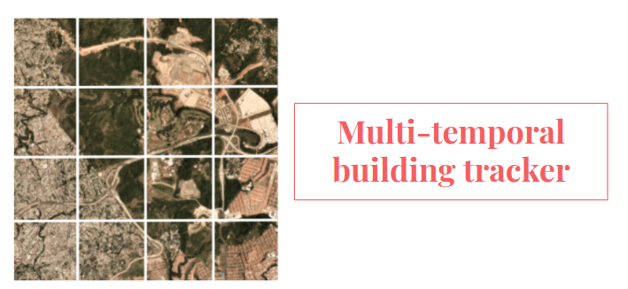

 

    
    
    

 

By [Sebastian Cajas](https://www.linkedin.com/in/sebasmos777/) and [Julián Salazar] (https://www.linkedin.com/in/julian-norberto-salazar-vidal-ipcv/)

This repository contains the implementation of Multi-target building tracker for satellite images using deep learning.
 
Proponent: Juan Carlos SanMiguel 

Supervisor: Fabien Baldacci

## Summary

The automatic analysis of satellite imagery has a wide range of applications within the field of urban planning, including fair distribution of resources, effective disaster response, updating of real-time maps and epidemiological vector-borne diseases control. Furthermore, it poses compelling technical challenges that even today are not completely solved. In light of this, the SpaceNet 7 Multi-Temporal Urban Development Challenge raised the task to identify and track buildings over time using a set of satellite images of moderate resolution and high variability. A new approach is proposed and implemented from scratch to solve the main flaws of the baseline algorithm, previously identified. In particular, three different types of convolutional neural networks were tested for the `segmentation of buildings` and complemented with preprocessing strategies. Once the building's contours were extracted, the task of tracking was addressed as a data assignment problem and solved via the `Hungarian algorithm`. An individual evaluation is presented for each stage and subsequently these are combined to analyse the full pipeline. At the end, the best results were achieved with an `UNET architecture`, enhanced by the use of `transfer learning`, a customized loss function and learning rate decay.

A  system  for  multi-target  building  tracking  using  satellite images  has  been  developed  following  the  guidelines  pro-posed in the SpaceNet 7 Multi-Temporal Urban Development Challenge  and  as  a  continuation  of  a  previous  theoretical exploration of the problem. The system was implemented by considering  each  individual  block:  a  preprocessing  stage,  a neural  network  for  semantic  segmentation,  and  an  algorithm for data assignment as a tracker for static targets. Even thoughthe dataset provides only images with moderate resolution and includes regions with high variability, crowded scenes, and ahigh number of targets, the model is able to segment correctly most  of  the  buildings  and  maintain  their  identities  along  the sequence with a 62% of Intersection over Union (IoU). The system is able to locate correctly the buildings in the image and to determine accurately their borders with the exception of those too close to each other. Most importantly, the system reacts well to changes, which is an important factor of concern for urban planning purposes. The tracker reaches a MOTA of 0.647 and a F-score of 0.805 on the testing set. 

#  Multi-temporal building tracker 

<<<<<<< HEAD
By [Sebastian Cajas](https://www.linkedin.com/in/sebasmos777/) and [Julián Salazar] (https://www.linkedin.com/in/julian-norberto-salazar-vidal-ipcv/)
=======
By [Sebastian Cajas](https://www.linkedin.com/in/sebasmos777/) and [Julián Salazar](https://www.linkedin.com/in/julian-norberto-salazar-vidal-ipcv/)
>>>>>>> 54c1e3843f5df8f85d93af9fd6d892178fe4152f

This repository contains the implementation of Multi-target building tracker for satellite images using deep learning.
 
Proponent: Juan Carlos SanMiguel 

Supervisor: Fabien Baldacci

## Summary

The automatic analysis of satellite imagery has a wide range of applications within the field of urban planning, including fair distribution of resources, effective disaster response, updating of real-time maps and epidemiological vector-borne diseases control. Furthermore, it poses compelling technical challenges that even today are not completely solved. In light of this, the SpaceNet 7 Multi-Temporal Urban Development Challenge raised the task to identify and track buildings over time using a set of satellite images of moderate resolution and high variability. A new approach is proposed and implemented from scratch to solve the main flaws of the baseline algorithm, previously identified. In particular, three different types of convolutional neural networks were tested for the `segmentation of buildings` and complemented with preprocessing strategies. Once the building's contours were extracted, the task of tracking was addressed as a data assignment problem and solved via the `Hungarian algorithm`. An individual evaluation is presented for each stage and subsequently these are combined to analyse the full pipeline. At the end, the best results were achieved with an `UNET architecture`, enhanced by the use of `transfer learning`, a customized loss function and learning rate decay.

A  system  for  multi-target  building  tracking  using  satellite images  has  been  developed  following  the  guidelines  pro-posed in the SpaceNet 7 Multi-Temporal Urban Development Challenge  and  as  a  continuation  of  a  previous  theoretical exploration of the problem. The system was implemented by considering  each  individual  block:  a  preprocessing  stage,  a neural  network  for  semantic  segmentation,  and  an  algorithm for data assignment as a tracker for static targets. Even thoughthe dataset provides only images with moderate resolution and includes regions with high variability, crowded scenes, and ahigh number of targets, the model is able to segment correctly most  of  the  buildings  and  maintain  their  identities  along  the sequence with a 62% of Intersection over Union (IoU). The system is able to locate correctly the buildings in the image and to determine accurately their borders with the exception of those too close to each other. Most importantly, the system reacts well to changes, which is an important factor of concern for urban planning purposes. The tracker reaches a MOTA of 0.647 and a F-score of 0.805 on the testing set. 
